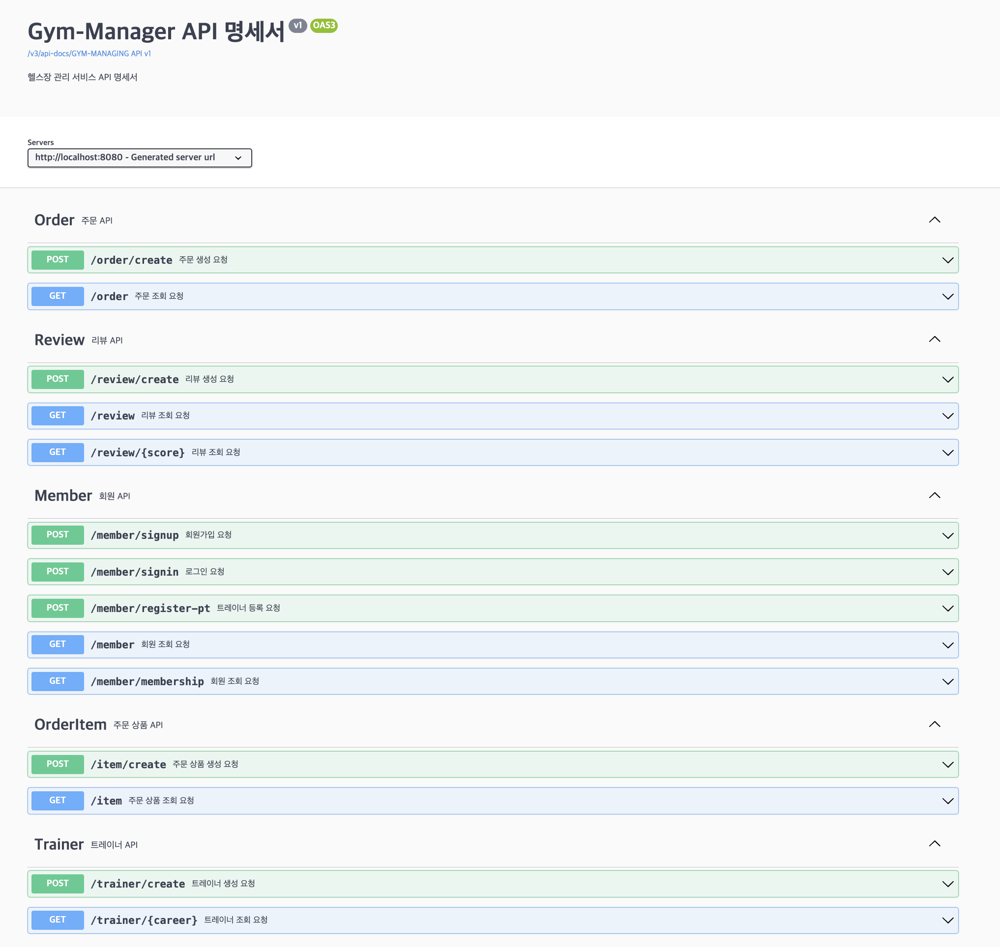
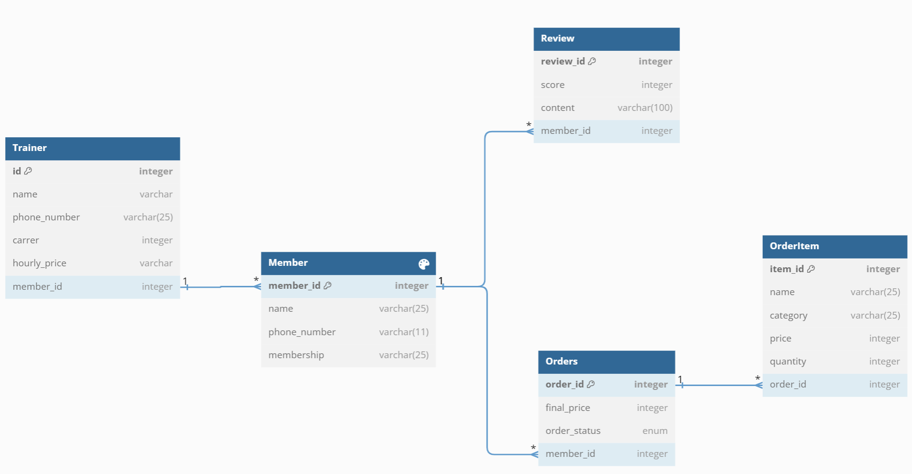

## 🏋 회원용 헬스장 관리 어플리케이션 🏋️
*** 
### 프로젝트 버전 정보
- Project : Gradle - Groovy
- Springboot : 3.1.5
- Java : 17
- Database : MySQL
---
### 프로젝트 소개 💁
헬스장의 서비스들을 온라인으로 접할 수 있는 어플리케이션입니다.
 
다음과 같은 기능을 이용할 수 있습니다.
- 회원 등록
- 헬스장 이용에 관한 리뷰 등록
- 개인 PT 트레이너 지정
- 단백질 식품 주문
---
### 🛠 Tech 🛠
  ️
  
️ ️ ️ ️

---

### API 📃

---
### ERD

